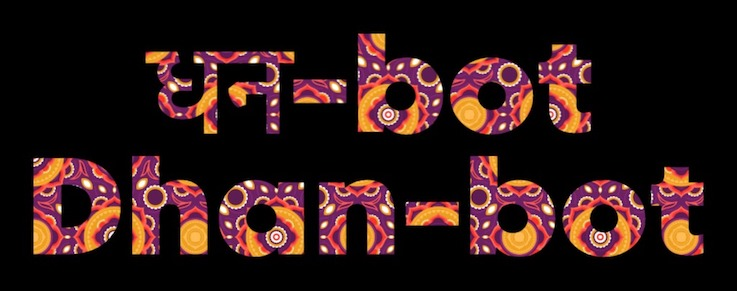
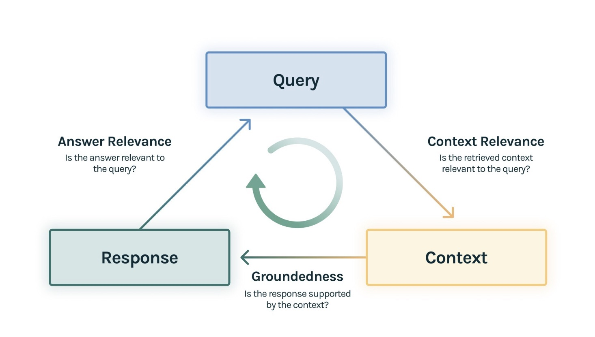

# Dhan-Bot:  A localized Finance-educator-bot with memory and evaluation, augmented with context of Indian Capital Markets.  


## Disclaimer ##
**IMPORTANT :** This is an example of a local Finance ChatBot augmented with knowledge context, in this case around Indian Capital Markets. The intent is to demonstrate how to build context aware LLM applications for a specific knowledge domain with evaluations. This applicagion should **NOT BE CONSTRUED OR USED AS ANY SORT OF FINANCIAL ADVISE**. ***NOR SHOULD*** the responses from this application used for any sort of investment trades or trade specific strategies or backtesting. The outcomes are unknown and there are no guarantees to it, if you do so.  

## Pronounciation Trivia  ## 
The word Dhan has an origin in the language Sanksrit for Wealth. It should be pronounced with a soft "a" in english, such as the a in "fa"(ther) and not as a in "ma"(n)

## Purpose ## 
  Organisations are increasingly seeking to build Large Language Models(LLM) applications for embodying organizational knowledge. However, due to data sensitivity and security concerns, such applications trained on internal knowledge bases cannot use API based provider ( e.g. OpenAI). The ability to use  powerful open Large language Models ( e.g. llama models from Meta) augmented with contextual datasets provide promising solutions. Yet,evaluating these applications remain a challenge. 

   In this AMP, we address some of these requirements in build Enterprise knowledge systems. Dhanbot, a Fineducator-bot is
  - Uses a llama(8b) model augmented on a Finance Varsity dataset using Retrieval Augmented Generation (RAG) ( see references for more details on RAG )
  - Holds memory i.e. remembers the prior question asked before formulating the next answer
  - Uses an evaluation Triad of Groundedness, Answer Relevance and Context Relevance to benchmarking LLM Performance ( see section the Triad for more on this topic)
  - Provides a ChatGPT style interface with streaming output to reduce the latency perceptions
  - Uses a vector database to save the knowledge base that is used to augment the context for the Q&A with the underlying LLM 

## The Tech Bits ##
### Runtime Pre-requisites: ##
The Dhan-bot AMP has some essential pre-requisites to work:
- A Custom community runtime called Ollama Runtime has been created. This runtime must be added to your Runtime catalog to enable the application to work. See instructions for adding the runtime [here](https://github.com/cloudera/community-ml-runtimes/tree/main/ollama)
-  GPU enabled compute: 1 GPU compute  instance is required to run the application and host the llama model. Use this for running the chat application, if you are not using the AMP. 

## Folder Structure ##
```
├── 0_session-install-dependencies: File sets up  the python packages to be installed
├── 2_job-data-ingest : File does a Web crawl and data ingest  to create a localized dataset
├── 3_app_run_llm_eval : Sets up the Tru Lens evaluation of the RAG Application
├── 4_app-run-chat-bot:  Runs the Finance bot application
├── assets
  ├── data
      ├── Chromadb : Contains the vectorized representations of the dataset 
      ├── index : stores the indexes for LLM Evaluations
      ├── questions: Stores a text file with evaluation questions
      ├── raw : stores the raw dataset that is generated by the web scrapper during data ingest
  ├── images
├── chainlit.md : Kept blank, can be configured for the chat bot application.
```

### Technology Stack and Architecture ###
Some of key components used for building this application are as follows:
- Ollama : used primarily for setting up local / off-the-grid LLMs
- Llamaindex : Used for setting up interfaces with the LLM and the front end application
- Chromadb : Vector Database holds the financial context dataset that is used to augment the prompts to the LLM
- Trulens : Used for evaluation and benchmarking based on Context Relevance, Answer Relevance and Groundedness of response 
- Chainlit : Used for the user interface. 

## Evaluation Triad ## 
For Evaluation we use the RAG Triad of Metrics described by TruLens and DeepLearning.ai 
(Reference / Image Credits: [Trulens](https://www.trulens.org/trulens_eval/getting_started/core_concepts/rag_triad/))


### Metrics Explanation:
1. **Context Relevance**: Assesses the quality of retrieved context in relation to the user’s query.
2. **Groundedness**: Measures how well the RAG’s final response is supported by the retrieved context.
3. **Answer Relevance**: Evaluates the relevance of the RAG’s final response to the original user query.

### Metrics Examples :
We use CML Metrics and the Trulens Dashboard to persist and review our evaluations.


# User Interface
- Application 1 : is the Chatbot that provides 


## References ##
- [Retrieval-Augmented Generation for Knowledge-Intensive NLP Tasks](https://arxiv.org/pdf/2005.11401)
- [Dataset - Zerodha Varsity](https://zerodha.com/varsity/): This is an educational resource providing Financial knowhow covering topics ranging from economy, government securities, financial and investment knowhow. The information at the time of building this app is free and open with no signup, no pay-wall and no adds ( as quoted from the weblink on 6.May.2024) 
- 
## Attribution ##
- Dhan-Bot image created with [Font Generator]("https://www.textstudio.com/")
