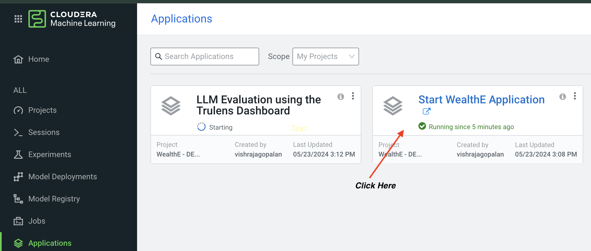
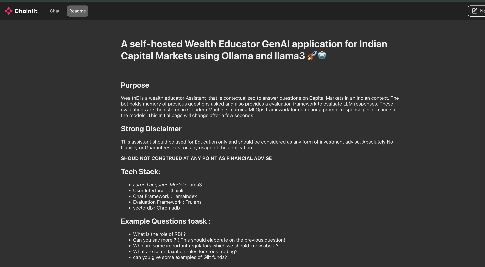
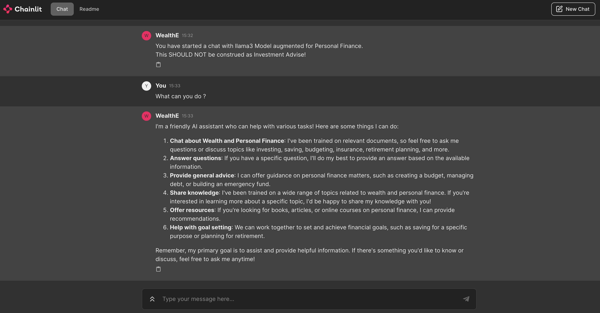

# WealthE:  A self-hosted Wealth Educator GenAI application for Indian Capital Markets using Ollama and llama3

## Disclaimer ##
**IMPORTANT :** This is an example of a GenAI Application that serves as a wealth assistant on Indian Capital Markets. The objectives is to demonstrate how to build domain specific GenAI applications. This application should **NOT BE CONSTRUED OR USED AS ANY SORT OF FINANCIAL ADVISE**. ***NOR SHOULD*** the responses from this application used for any sort of investment trades or trade specific strategies or backtesting. The outcomes are unknown and there are no guarantees to it, if you do so.  


---


## Table Of Contents 
- [Purpose](#purpose)
- [ About WealthE](#about-wealthe)
- [How to DEMO WealthE](#how-to-demo-wealthe)
  - [Part 1 : GenAI Chat Demo](#part-1-demo-the-rag-genai-application-by-launching-wealthe-in-cloudera-machine-learning)
  - [Part 2: LLM Ops Demo](#part-2-demo-llmops--evaluation-of-the-genai-applications)
- [The Tech Stack](#the-tech-stack)
  - [Prerequisites](#runtime-pre-requisites)
  - [Components](#software-components)
  - [Folder Structure](#folder-structure)
- [References](#references)
---
## Purpose ## 
  Organisations are increasingly seeking to build Large Language Models(LLM) applications for embodying organizational knowledge. However, due to data sensitivity and security concerns, such applications trained on internal knowledge bases cannot use Cloud based API based providers. The ability to use  powerful open Large language Models ( e.g. llama models from Meta) augmented with contextual datasets provide promising solutions. Yet,evaluating these applications remain a challenge. 

   With WealthE, we address some of these requirements in building enterprise knowledge systems using GenAI with performance evaluation metrics.
   WealthE is a wealth educator on Indian Capital Markets that
  - uses OLLAMA a very popular service for self-hosting open models into ring fenced private networks.
  - uses a llama3(8b) model augmented on a capital makets and finance education data using Retrieval Augmented Generation (RAG) ( see references for more details on RAG )
  - holds memory i.e. remembers the prior question asked before formulating the next answer
  - demonstrates LLMOps : Uses an evaluation Triad of groundedness, answer relevance and context relevance to benchmark LLM Performance ( see section on [Part 2: LLM Ops Demo](#part-2-demo-llmops--evaluation-of-the-genai-applications) and [References](#references) for more details )
  - provides a ChatGPT style "smart" interface with streaming output to reduce the latency perceptions
  - uses a vector database to save the vector representations of the "Context" data that is used to augment the prompt to the LLM application


## About WealthE
  WealthE serves as a wealth education assistant answering queries in Q&A style using a contextualized LLM. The "context augmentation" is
  achieved through contextualization of capital markets with a focus on India.


  
  
  The application also holds memory 
  across conversations. For. e.g. "when the user types can you tell me more ?". It remembers the earlier response and elaborates the response.
  
  


## How to DEMO WealthE:
### **Part 1:**  Demo the RAG GenAI Application by  Launching WealthE in Cloudera Machine Learning

We can launch the WealthE Application from Cloudera Machine Learning. Here are the steps:
- Click on the WealthE project that is already set up for Demo or created through an Applied Machine Learning Prototype (comming soon)
- Click on the Applications Menu item and click "Start the WealthE Application", if it is not running, you may need to run the application. 



- This launches the home screen of the application, as below


- After a few seconds you get the chat screen, which you can use to start chatting with the application. Start by typing one of the following suggested prompts to get a response shown below

```
What can you do ? 
```



- We can also demonstrate the ability of the Application to remember the earlier prompts accurately as explained earlier. For e.g. first ask the question below
```
can you summarize index funds in 3 sentences?
```
Subsequently you can ask the Application to elaborate by simply giving the following prompt and it  remembers that we were discussing index funds.
```
what are some examples ? 
```


## **Part 2:** Demo LLMOPs : Evaluation of the GenAI  Applications 
  We demonstrate extensibility of Cloudera easy integration to LLMOps frameworks  for evaluating LLM Performance using Trulens as our Prompt evaluation framework. 

  
  ### Demonstrating LLM Ops on Cloudera Machine Learning : 

  LLM Performance is computed on the RAG Triad of  metrics : context relevance, answer relevance and groundedness. Since Human evaluation is nigh impossible to do at scale, we use a LLM-as-a-judge to evaluate performance. 
  
  
  We can read more about this approach from Trulens documentation in reference. We can further drill down to each strategy used e.g. Baseline vs SentenceWindow3 to understand the reason why scores are below par for some responses (see example below)
  

  The prompts used for evaluation are stored in a text format in assets/data/questions/evaluation_questions.txt. Feel free to change some prompts to come up with new evaluation metrics. However, do note that LLM evaluations are time consuming.

  To perform new evaluations with newer prompts
  - add additional questions or modify the questions in this evaluation_questions.txt mentioned before 
  - re-run 3_session-evaluate-llm step 
  - view the results by rerunning the app.py file in 4_app-run-evaluation-dashboard.

  Finally, you can persist the new evaluations with the earlier ones in mlflow using 5_session-save-evaluations-in-mlflow. Following 2 questions are already performed. 
  ```
    What is fundamental Analysis ? 
    What are tax implications for traders ?
  ```
  
  Below we see the evaluations persisted in MLflow in Cloudera Machine Learning. This helps us compare overtime the performance of the application for newer prompts.
    
  
  
  
  **Note** : Since human evaluations are time consuming, we use LLMs to perform the evaluations. This is resource and time intensive and hence you may need to carefully
  evaluate the questions you will use for LLM evaluations. 
  
  
## The Tech Stack ##
### Runtime Prerequisites: ###
The WealthE AMP has some essential pre-requisites to work:
- A Custom community runtime called Ollama Runtime has been created. This runtime must be added to your Runtime catalog to enable the application to work. See instructions for adding the runtime [here](https://github.com/cloudera/community-ml-runtimes/tree/main/ollama)
-  GPU enabled compute: 1 GPU compute  instance is required to run the application and host the llama model. Use this for running the chat application, if you are not using the AMP. 


### Software Components ###
Some of key components used for building this application are as follows:
- Ollama: used primarily for setting up local / off-the-grid LLMs
- Llamaindex: Used for setting up interfaces with the LLM and the front end application
- Chromadb: Vector Database holds the financial context dataset that is used to augment the prompts to the LLM
- Trulens: Used for evaluation and benchmarking based on Context Relevance, Answer Relevance and Groundedness of response 
- Chainlit: Used for the user interface. 


### Folder Structure ###
```
├── 0_session-install-dependencies: File sets up  the python packages to be installed
├── 2_job-data-ingest: File does a Web crawl and data ingest  to create a localized dataset
├── 3_app_run_llm_eval: Sets up the Tru Lens evaluation of the RAG Application
├── 4_app-run-chat-bot:  Runs the Finance bot application
├── assets
  ├── data
      ├── Chromadb: Contains the vectorized representations of the dataset 
      ├── index: stores the indexes for LLM Evaluations
      ├── questions: Stores a text file with evaluation questions
      ├── raw: stores the raw dataset that is generated by the web scrapper during data ingest
      ├── chroma_db: used to persist the vector embeddings of the source dataset
      ├── trulens_db: saves the evaluation results of the LLM 
  ├── images
├── chainlit.md: Configurations for the Chat UI
```


## References ##
- [Retrieval-Augmented Generation for Knowledge-Intensive NLP Tasks](https://arxiv.org/pdf/2005.11401)
- [Dataset - Zerodha Varsity](https://zerodha.com/varsity/): An open financial education varsity on Indian capital markets

### Evaluation Triad ## 
For Evaluation we use the RAG Triad of Metrics described by TruLens and DeepLearning.ai 
(Reference / Image Credits: [Trulens](https://www.trulens.org/trulens_eval/getting_started/core_concepts/rag_triad/))


### Metrics Explanation:
1. **Context Relevance**: Assesses the quality of retrieved context in relation to the user’s query.
2. **Groundedness**: Measures how well the RAG’s final response is supported by the retrieved context.
3. **Answer Relevance**: Evaluates the relevance of the RAG’s final response to the original user query.

## Attribution ##
- Image created using Free Adobe Image Generator